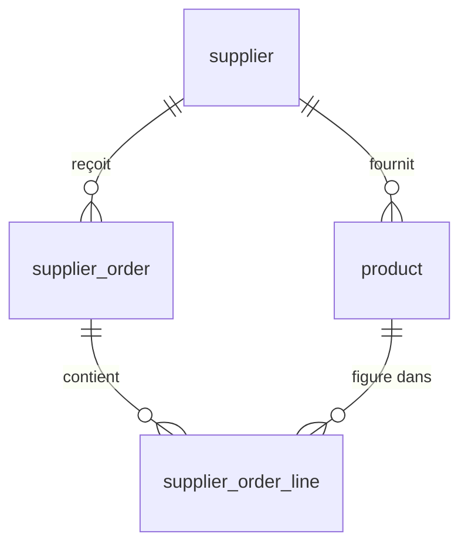

# Modèle de données

Le modèle couvre les deux modules du périmètre MVP : le catalogue — fournisseurs,
produits, niveau de stock — et les commandes fournisseurs. Il tient en quatre
tables. Le schéma est créé exclusivement par les
[migrations](../reference/lexique.md#migration) Flyway
`V1__stock.sql` et `V2__supplier_orders.sql` : Hibernate est configuré en
`ddl-auto: validate` et ne crée ni ne modifie rien.

## Vue d'ensemble

Les quatre relations se lisent ainsi :

- Un fournisseur fournit plusieurs produits ; un produit a exactement un
  fournisseur.
- Un fournisseur reçoit plusieurs commandes ; une commande s'adresse à
  exactement un fournisseur.
- Une commande contient plusieurs lignes ; une ligne appartient à exactement une
  commande.
- Un produit figure dans plusieurs lignes, réparties sur plusieurs commandes ;
  une ligne porte exactement un produit.

## Le motif en-tête / lignes

Une commande se répartit sur deux tables. `supplier_order` porte le contexte :
à qui la commande s'adresse, où elle en est de son cycle, quand elle a été créée,
envoyée, reçue. `supplier_order_line` porte ce que l'on veut d'un produit dans
cette commande précise : la quantité et le prix unitaire.

**Une ligne n'est pas un produit.** Le produit vit dans `product`,
indépendamment de toute commande. La ligne ne fait que le désigner, par son
`product_id`, en y ajoutant ce qui n'a de sens que dans cette commande-là. Un
même produit apparaît dans autant de commandes que nécessaire sans jamais être
dupliqué : commander à nouveau de la farine ne crée pas une seconde farine au
catalogue, seulement une nouvelle ligne.

Présentée comme un bon de commande, la commande n° 42 chez Grossiste Delval
donne ceci :

| | Produit | Quantité | Unité | Prix unitaire |
| --- | --- | --- | --- | --- |
| Ligne 1 | Farine T55 | 25,000 | kg | 0,95 |
| Ligne 2 | Beurre doux | 10,000 | kg | 8,40 |
| Ligne 3 | Œufs | 360,000 | unité | 0,28 |

L'en-tête — commande n° 42, Grossiste Delval, statut `DRAFT` — est stocké une
fois dans `supplier_order`. Les trois lignes sont trois enregistrements de
`supplier_order_line` pointant vers la même commande et vers trois produits
distincts du catalogue.

La contrainte `uq_order_line_product` interdit qu'un produit figure deux fois
dans la même commande : commander davantage de farine ajuste la quantité de la
ligne existante plutôt que d'ajouter une seconde ligne farine.

## Les tables, une par une

Les termes génériques employés ci-dessous — clé étrangère, index, contrainte,
[migration](../reference/lexique.md#migration),
[ORM](../reference/lexique.md#orm-object-relational-mapping) — ne sont pas
redéfinis ici. Le [lexique](../reference/lexique.md) fait référence pour le
vocabulaire du projet.

### `supplier`

Un fournisseur auprès duquel le restaurant s'approvisionne. Il est choisi en
premier lors de la création d'une commande ; la sélection des produits en
découle.

| Colonne | Type | Description |
| --- | --- | --- |
| `id` | `BIGINT` généré | Identifiant, `GENERATED ALWAYS AS IDENTITY` |
| `name` | `VARCHAR(150)` | Raison sociale. Obligatoire |
| `email` | `VARCHAR(255)` | Facultatif. Sans contrainte d'unicité |
| `phone` | `VARCHAR(30)` | Facultatif |
| `address` | `TEXT` | Facultatif. Longueur libre, une adresse tient mal dans un gabarit fixe |

L'email n'est pas unique : deux établissements d'un même grossiste partagent
couramment une adresse de contact.

### `product`

Un article référencé au catalogue, rattaché à un fournisseur unique. Il porte à
la fois sa description commerciale et son niveau de stock.

| Colonne | Type | Description |
| --- | --- | --- |
| `id` | `BIGINT` généré | Identifiant |
| `name` | `VARCHAR(150)` | Libellé du produit. Obligatoire |
| `unit` | `VARCHAR(20)` | Unité de vente : `kg`, `L`, `unité` |
| `unit_price` | `NUMERIC(10,2)` | Prix courant au catalogue. `CHECK (unit_price >= 0)` |
| `supplier_id` | `BIGINT` | Clé étrangère vers `supplier(id)`, `ON DELETE RESTRICT` |
| `alert_threshold` | `NUMERIC(10,3)` | [Seuil d'alerte](../reference/lexique.md#seuil-dalerte), défaut `0`. `CHECK (alert_threshold >= 0)` |
| `stock` | `NUMERIC(10,3)` | Quantité disponible, défaut `0`. `CHECK (stock >= 0)` |

`ON DELETE RESTRICT` empêche de supprimer un fournisseur encore référencé par un
produit : le catalogue ne peut pas contenir de produit orphelin.

L'indicateur [« sous le seuil »](../reference/lexique.md#sous-le-seuil) et la
[quantité suggérée](../reference/lexique.md#quantité-suggérée) ne sont pas des
colonnes : ils se déduisent de `stock` et `alert_threshold` à la lecture.

### `supplier_order`

L'en-tête d'une commande fournisseur : son destinataire, son statut, ses dates.

| Colonne | Type | Description |
| --- | --- | --- |
| `id` | `BIGINT` généré | Identifiant |
| `supplier_id` | `BIGINT` | Clé étrangère vers `supplier(id)`, `ON DELETE RESTRICT` |
| `status` | `VARCHAR(20)` | `CHECK (status IN ('DRAFT', 'SENT', 'RECEIVED'))` |
| `created_at` | `TIMESTAMPTZ` | Création. Défaut `now()`, obligatoire |
| `sent_at` | `TIMESTAMPTZ` | Passage en `SENT`. Nul tant que la commande est un brouillon |
| `received_at` | `TIMESTAMPTZ` | Passage en `RECEIVED`. Nul avant la livraison |

`supplier_id` est porté par l'en-tête et non déduit des lignes. Une commande
s'adresse à un fournisseur et un seul, y compris lorsqu'elle n'a encore aucune
ligne.

### `supplier_order_line`

Ce qui est commandé d'un produit dans une commande donnée.

| Colonne | Type | Description |
| --- | --- | --- |
| `id` | `BIGINT` généré | Identifiant |
| `supplier_order_id` | `BIGINT` | Clé étrangère vers `supplier_order(id)`, `ON DELETE CASCADE` |
| `product_id` | `BIGINT` | Clé étrangère vers `product(id)`, `ON DELETE RESTRICT` |
| `quantity` | `NUMERIC(10,3)` | Quantité commandée. `CHECK (quantity > 0)` |
| `unit_price` | `NUMERIC(10,2)` | Prix unitaire figé à la création de la ligne. `CHECK (unit_price >= 0)` |

Les deux comportements de suppression diffèrent volontairement. `ON DELETE
CASCADE` sur la commande : une ligne n'a aucune existence hors de son en-tête,
supprimer la commande emporte ses lignes. `ON DELETE RESTRICT` sur le produit :
un produit cité par une commande ne peut pas être supprimé du catalogue, sans
quoi la commande deviendrait illisible.

`CHECK (quantity > 0)` traduit une règle métier : une ligne à quantité nulle
n'exprime rien. L'ajout d'un produit non sous le seuil est autorisé, mais la
quantité est alors saisie, sans valeur par défaut.

### Choix de typage

**`NUMERIC(10,3)` pour les quantités.** Les unités de vente ne sont pas toutes
entières : la farine et le beurre se commandent au kilogramme, l'huile au litre.
Un type entier interdirait 2,5 kg. Trois décimales couvrent le gramme et le
millilitre.

**`NUMERIC(10,2)` pour les montants, jamais `FLOAT`.** Les types à virgule
flottante ne représentent pas exactement les décimaux : additionner des prix en
`FLOAT` produit des écarts au centime, qui se propagent dans les totaux d'une
commande. `NUMERIC` stocke la valeur décimale exacte. Deux décimales suffisent
pour un prix en euros.

**`TIMESTAMPTZ` pour les dates.** Le serveur et les utilisateurs ne sont pas
nécessairement dans le même fuseau. Un instant sans fuseau est ambigu : « reçue
à 8 h » ne désigne pas le même moment selon l'endroit où la valeur est lue.
`TIMESTAMPTZ` stocke un instant absolu, que chaque client affiche dans son
propre fuseau.

**`VARCHAR(20)` et `CHECK` pour le statut, plutôt qu'un `ENUM` PostgreSQL.** Les
deux garantissent la même chose : `status` ne peut valoir que `DRAFT`, `SENT` ou
`RECEIVED`. Le `CHECK` se lit directement dans la définition de la table et
s'ajuste par une migration ordinaire, là où un type `ENUM` est un objet distinct
du schéma, modifiable seulement par `ALTER TYPE` et dont une valeur ne peut pas
être retirée. Le cycle étant figé, l'expressivité supplémentaire de l'`ENUM` ne
sert à rien.

## La réception d'une commande

Le passage en `RECEIVED` est le seul moment où le stock bouge. Il ne bouge pas à
l'envoi : une commande `SENT` est partie chez le fournisseur, rien n'est encore
entré en cuisine.

Deux tables sont modifiées :

1. `supplier_order` — `status` passe à `RECEIVED`, `received_at` prend l'instant
   courant.
2. `product` — pour chaque ligne de la commande, `stock` est incrémenté de
   `quantity`.

**Les deux modifications se déroulent dans une seule transaction.** Une panne
entre les deux laisserait une commande marquée reçue avec un stock partiellement
à jour. Le schéma ne conserve aucune trace des mouvements de stock : rien ne
permettrait ensuite de détecter l'incohérence, encore moins de la corriger. La
transaction est la seule garantie disponible.

Sur la commande n° 42, la réception donne :

| Produit | Seuil | Stock avant | Quantité reçue | Stock après |
| --- | --- | --- | --- | --- |
| Farine T55 | 20,000 | 15,000 | 25,000 | 40,000 |
| Beurre doux | 6,000 | 2,000 | 10,000 | 12,000 |
| Œufs | 240,000 | 120,000 | 360,000 | 480,000 |

Les trois produits étaient sous leur seuil avant la réception, aucun ne l'est
après. Les quantités correspondent ici à la quantité suggérée,
`max(0, 2 × seuil − stock)`, mais rien ne l'impose : la suggestion est une
proposition, la quantité retenue est celle que l'utilisateur a validée à
l'ajout, et elle n'est plus recalculée ensuite.

Côté `supplier_order`, `status` passe de `SENT` à `RECEIVED` et `received_at`
cesse d'être nul. Les lignes, elles, ne changent pas : `quantity` et
`unit_price` restent ce qu'ils étaient.

## Ce que le schéma n'a pas, et pourquoi

| Absence | Raison |
| --- | --- |
| Table `stock_movement` | Le stock est un état courant, pas un journal de mouvements. Voir l'[ADR-005](../adr/adr-005-stock-etat-courant.md) |
| Colonne `suggested_quantity` | Calculée à la volée : `max(0, 2 × seuil − stock)`. Jamais persistée |
| Colonne `received_quantity` | Reçu = commandé. La [réception partielle](../reference/lexique.md#réception-partielle) est hors périmètre MVP |
| Colonne `origin` sur la ligne | Une ligne suggérée et une ligne ajoutée à la main sont indiscernables en base, volontairement : le système propose, l'utilisateur décide, et seule sa décision est enregistrée |
| Statut `CANCELLED` | Le cycle est figé à `DRAFT` → `SENT` → `RECEIVED`. Une transition non séquentielle est refusée par l'application |
| Contrainte SQL « même fournisseur » | Aucune contrainte n'impose que le produit d'une ligne provienne du fournisseur de la commande. Le contrôle est applicatif, assumé, et garanti par un test d'intégration |

Ce dernier point est le seul endroit où une règle métier n'est pas tenue par le
schéma. L'exprimer en SQL demanderait de dupliquer `supplier_id` sur la ligne
pour former une clé étrangère composite — une colonne redondante sur la table la
plus volumineuse, pour une règle que la couche applicative vérifie déjà au
moment où elle constitue la commande.

### Le prix figé sur la ligne

`supplier_order_line.unit_price` est recopié depuis `product.unit_price` à la
création de la ligne. Les deux colonnes portent la même information au même
instant, ce qui ressemble à une redondance — c'en est une, et elle est
volontaire.

`product.unit_price` est le prix courant au catalogue : il change quand le
fournisseur change ses tarifs. `supplier_order_line.unit_price` est le prix
auquel cette commande-là a été passée. Sans cette copie, une hausse de tarif
réécrirait rétroactivement le montant de toutes les commandes déjà envoyées ou
reçues.

## Nommage

Les tables s'appellent `supplier_order` et `supplier_order_line`, jamais
`order`, pour deux raisons distinctes.

`ORDER` est un mot réservé SQL — celui de `ORDER BY`. Une table ainsi nommée
imposerait des guillemets dans chaque requête qui la mentionne, et la moindre
omission produirait une erreur de syntaxe déroutante.

Le préfixe lève surtout une ambiguïté de vocabulaire. « Commande » désigne deux
choses en français : l'approvisionnement auprès d'un fournisseur, objet de ce
modèle, et la [commande client](../reference/lexique.md#commande-client) — des
plats du menu — qui relève de MenuForge, hors périmètre MVP. Les deux notions
auront leurs tables, `supplier_order` et `customer_order`, et le nom seul suffit
à les distinguer.
