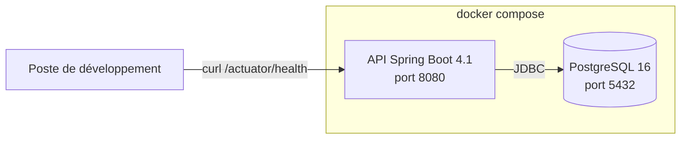
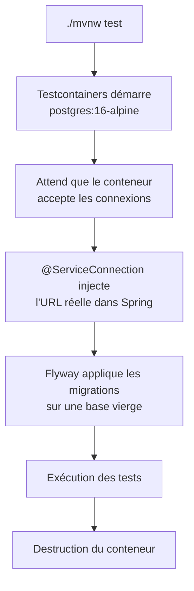
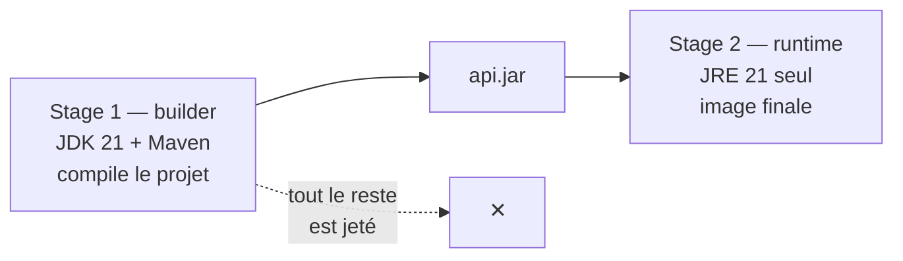
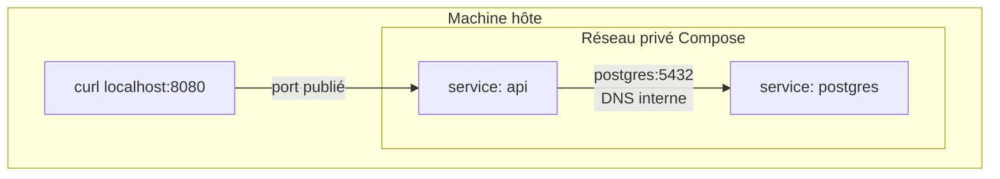

# Bootstrap de l'API Spring Boot

Ce guide retrace la mise en place complète du backend : génération du projet,
connexion à PostgreSQL, endpoint de santé, tests d'intégration isolés et
conteneurisation.

À l'arrivée, une seule commande démarre l'ensemble de la stack.

## Ce qu'on construit



| Brique | Rôle |
| --- | --- |
| Spring Boot 4.1 · Java 21 | Backend unique, servira tous les fronts |
| PostgreSQL 16 | Base de données, conteneurisée |
| Flyway | Migrations de schéma versionnées |
| Actuator | Endpoint de santé |
| Testcontainers | Base éphémère pour les tests |

## Prérequis

```bash
java -version      # 21
docker info        # doit répondre sans erreur
```

---

## 1. Génération du projet

Le squelette vient de [start.spring.io](https://start.spring.io).

| Champ | Valeur |
| --- | --- |
| Project | Maven |
| Spring Boot | 4.1.0 |
| Java | 21 |
| Group | `com.restoforge` |
| Artifact / Name | `api` |
| Package | `com.restoforge.api` |
| Packaging | Jar |
| Configuration | YAML |

**Dépendances** : Spring Web · Spring Data JPA · Validation · PostgreSQL
Driver · Flyway Migration · Spring Boot Actuator

:::tip Packaging Jar, pas War
Spring Boot embarque son propre serveur Tomcat. L'application est un exécutable
autonome, ce qui rend le `Dockerfile` trivial : un JRE et un fichier `.jar`
suffisent.
:::

:::caution Group et Package se renomment mal
Une fois du code écrit, changer le package racine devient un refactor sur chaque
fichier. Ces deux champs méritent d'être posés correctement dès la génération.
:::

### Structure obtenue

```
api/
├── pom.xml                              → équivalent de package.json
├── mvnw                                 → Maven embarqué, façon npx
├── .mvn/
└── src/
    ├── main/java/com/restoforge/api/
    │   └── ApiApplication.java          → point d'entrée
    ├── main/resources/
    │   ├── application.yml              → équivalent de environment.ts
    │   └── db/migration/                → Flyway lira ici
    └── test/java/com/restoforge/api/
        └── ApiApplicationTests.java
```

`ApiApplication` porte l'annotation `@SpringBootApplication`, qui déclenche au
démarrage le scan de tout ce qui se trouve sous `com.restoforge.api`. **Une
classe placée en dehors de ce package ne sera jamais vue par Spring** — source
d'erreur la plus fréquente en début de projet.

:::info `./mvnw` et non `mvn`
Le wrapper fige la version de Maven définie dans `.mvn/wrapper/`. Tout le monde
compile avec la même version, intégration continue comprise.
:::

---

## 2. Configuration

Le premier démarrage échoue :

```
APPLICATION FAILED TO START
Failed to configure a DataSource: 'url' attribute is not specified
```

Spring ne dit pas « je n'arrive pas à joindre la base » mais « je ne sais pas où
elle est ». Il n'a tenté aucune connexion.

Le mécanisme derrière s'appelle l'**auto-configuration** : Spring Boot inspecte
le classpath au démarrage, y trouve le driver PostgreSQL, en déduit que
l'application parle à une base, et tente de construire une `DataSource`. Sans
URL, il refuse de démarrer plutôt que de démarrer à moitié.

C'est un principe récurrent en Spring Boot : **la présence d'une dépendance
déclenche un comportement**. On n'écrit pas « configure une base de données », on
ajoute le driver et Spring en tire les conséquences.

### `application.yml`

```yaml
spring:
  application:
    name: api

  datasource:
    url: "jdbc:postgresql://${DB_HOST:localhost}:${DB_PORT:5432}/${POSTGRES_DB:restoforge}"
    username: ${POSTGRES_USER:restoforge}
    password: ${POSTGRES_PASSWORD:changeme}

  jpa:
    hibernate:
      ddl-auto: validate
    open-in-view: false

  flyway:
    enabled: true

management:
  endpoint:
    health:
      show-details: always
```

:::caution `management` est une clé racine
`management` se place au même niveau que `spring`, pas à l'intérieur. Imbriquée
par erreur sous `spring`, la clé est ignorée sans le moindre avertissement :
l'application démarre normalement et `/actuator/health` renvoie `{"status":"UP"}`
sans le détail du composant `db`.
:::

### Trois décisions à comprendre

**`${VARIABLE:défaut}`** se lit : « prends la variable d'environnement si elle
existe, sinon cette valeur ». Un seul fichier sert ainsi deux contextes — en
local l'API vise `localhost`, en conteneur Compose injecte `DB_HOST=postgres`.

**`ddl-auto: validate`** interdit à Hibernate de créer ou modifier des tables.
Il vérifie seulement, au démarrage, que les entités correspondent au schéma
réel. **Flyway est la seule autorité sur le schéma.** Sans cette valeur, deux
systèmes modifieraient la base sans se concerter.

**`open-in-view: false`** désactive le maintien d'une session base de données
pendant tout le rendu de la réponse HTTP. Le comportement par défaut masque les
problèmes de chargement et coûte cher en production.

:::caution Spring Boot ne lit pas le fichier `.env`
`.env` est une convention Docker Compose. Lancée depuis un terminal, l'API ne
voit pas ces variables et retombe sur les valeurs par défaut — d'où un
`password authentication failed` trompeur.

```bash
set -a && source ../.env && set +a
```

`set -a` exporte automatiquement toute variable définie ensuite. Sans lui,
`source` les charge dans le shell sans les transmettre au processus Java. Ces
variables ne survivent qu'à la session courante.
:::

### Démarrage

```bash
docker compose up -d
docker compose ps          # attendre 'healthy', pas seulement 'running'

cd api
set -a && source ../.env && set +a
./mvnw spring-boot:run
```

Les lignes qui confirment que tout va bien :

| Log | Signification |
| --- | --- |
| `HikariPool-1 - Start completed` | Le pool de connexions est ouvert |
| `Creating Schema History table` | Flyway s'est initialisé |
| `No migrations found` | Attendu : `db/migration/` est vide |
| `Tomcat started on port 8080` | Le serveur écoute |

---

## 3. Endpoint de santé

Actuator l'expose sans qu'aucun code soit écrit :

```bash
curl -s localhost:8080/actuator/health
```

```json
{
  "status": "UP",
  "components": {
    "db": { "status": "UP", "details": { "database": "PostgreSQL" } }
  }
}
```

Le statut agrégé bascule à `DOWN` si PostgreSQL tombe — Actuator détecte la
`DataSource` et l'interroge automatiquement. Pour le vérifier :
`docker compose stop postgres`, puis rappeler l'endpoint.

Le chemin `/actuator/health` est conservé plutôt que `/health` : c'est le chemin
conventionnel attendu par les healthchecks Docker et les probes Kubernetes, et
le préfixe sépare les endpoints techniques des endpoints métier (`/api/...`).

---

## 4. Tests d'intégration

Le test généré est vide, et c'est voulu :

```java
@SpringBootTest
class ApiApplicationTests {
    @Test
    void contextLoads() { }
}
```

`@SpringBootTest` charge le contexte Spring complet — configuration, beans,
datasource, Flyway. Si quoi que ce soit est mal câblé, le test échoue avant
d'entrer dans la méthode. Il n'attrape aucun bug métier, mais toutes les erreurs
de configuration.

### Le problème

Sans configuration dédiée, ce test se connecte à la **base de développement
réelle**. Il passe alors pour une mauvaise raison : parce que l'environnement
local est correctement configuré, pas parce que le code est bon.

Trois conséquences : l'intégration continue échoue faute d'environnement, les
futurs tests écrivant en base pollueront les données de développement, et le
résultat dépend de la machine.

### La solution retenue



Testcontainers démarre un vrai PostgreSQL le temps des tests, dans la même
version que la production. Alternative écartée : H2 en mémoire, plus rapide mais
dont les types, la syntaxe et les contraintes diffèrent — valider des migrations
Flyway contre un moteur qu'on n'exécute nulle part ne prouve rien.

**Dépendances**, dans `<dependencies>` du `pom.xml` :

```xml
<dependency>
    <groupId>org.springframework.boot</groupId>
    <artifactId>spring-boot-testcontainers</artifactId>
    <scope>test</scope>
</dependency>
<dependency>
    <groupId>org.testcontainers</groupId>
    <artifactId>testcontainers-postgresql</artifactId>
    <scope>test</scope>
</dependency>
```

Aucune balise `<version>` : le `spring-boot-starter-parent` gère une liste de
versions compatibles. `<scope>test</scope>` exclut ces dépendances du jar final.

:::caution Les modules Testcontainers ont été renommés en 2.x
Spring Boot 4.1 importe `testcontainers-bom` 2.x, où tous les modules portent
désormais le préfixe `testcontainers-` : `org.testcontainers:postgresql` est
devenu `org.testcontainers:testcontainers-postgresql`.

L'ancien nom n'étant plus géré par le BOM, aucune version ne lui est appliquée
et Maven s'arrête sur :

```
'dependencies.dependency.version' for org.testcontainers:postgresql:jar is missing
```

La plupart des tutoriels en ligne visent encore Spring Boot 3 et Testcontainers
1.x — c'est le piège le plus courant sur cette étape.
:::

**Configuration**, dans `src/test/java/com/restoforge/api/` :

```java
@TestConfiguration(proxyBeanMethods = false)
public class TestcontainersConfiguration {

    @Bean
    @ServiceConnection
    PostgreSQLContainer<?> postgresContainer() {
        return new PostgreSQLContainer<>("postgres:16-alpine");
    }
}
```

**Activation**, sur la classe de test :

```java
@Import(TestcontainersConfiguration.class)
@SpringBootTest
class ApiApplicationTests { /* ... */ }
```

:::info Pourquoi `@ServiceConnection` est nécessaire
Docker publie le conteneur de test sur un **port aléatoire** — sinon il
entrerait en conflit avec la base de développement déjà sur 5432. L'URL de
connexion n'est donc connue qu'à l'exécution et ne peut pas être écrite dans un
fichier. `@ServiceConnection` la lit sur le conteneur démarré et l'injecte avant
que Spring ne construise sa datasource.
:::

:::tip Vérifier que le test passe pour la bonne raison
Dans les logs, chercher la ligne `Database JDBC URL`. Elle doit afficher un port
aléatoire et une base nommée `test` :

```
jdbc:postgresql://localhost:64957/test
```

Si elle affiche `localhost:5432/restoforge`, le conteneur n'est pas utilisé et
le test s'appuie sur la base de développement.
:::

---

## 5. Conteneurisation

### Build multi-stage

Compiler demande un JDK, Maven et toutes les dépendances. Exécuter ne demande
qu'un JRE et un `.jar`. Le multi-stage sépare les deux dans un seul fichier :



```dockerfile
FROM eclipse-temurin:21-jdk-alpine AS builder
WORKDIR /build

# Le wrapper et le POM d'abord, sans le code source.
COPY mvnw ./
COPY .mvn/ .mvn/
COPY pom.xml ./

RUN ./mvnw dependency:go-offline

# Le code source vient après : c'est ce qui change à chaque commit.
COPY src/ src/
RUN ./mvnw clean package -DskipTests

FROM eclipse-temurin:21-jre-alpine
WORKDIR /app

RUN addgroup -S spring && adduser -S spring -G spring
COPY --from=builder /build/target/api.jar app.jar
USER spring

EXPOSE 8080
ENTRYPOINT ["java", "-jar", "/app/app.jar"]
```

**L'ordre des `COPY` n'est pas cosmétique.** Docker met en cache chaque
instruction et la réutilise tant que les fichiers copiés n'ont pas changé. En
téléchargeant les dépendances avant de copier le code, la couche de dépendances
survit à toute modification d'une classe Java : le rebuild passe de plusieurs
minutes à quelques secondes.

:::info Le cache se base sur le contenu, pas sur la date
Un `touch` sur un fichier source ne déclenche aucun rebuild : Docker compare les
empreintes du contenu. Pour observer l'invalidation du cache, il faut modifier
un fichier pour de bon.
:::

:::tip Un nom de jar indépendant de la version
`COPY --from=builder /build/target/api.jar` suppose `<finalName>api</finalName>`
dans le `<build>` du `pom.xml`. Sans lui, le jar s'appelle
`api-0.0.1-SNAPSHOT.jar` et le `Dockerfile` — comme la CI et les scripts de
déploiement — doit connaître le numéro de version courant.
:::

**`-DskipTests`** est délibéré : les tests exigent un démon Docker
(Testcontainers), et on ne lance pas Docker dans Docker. Ils s'exécutent en
intégration continue, en amont de la construction de l'image.

**L'utilisateur non-root** limite les privilèges en cas d'évasion du conteneur.
Le jar appartient à root et `spring` ne peut que le lire — le processus ne peut
pas modifier son propre binaire.

`.dockerignore` évite d'envoyer `target/` dans le contexte de build :

```
target/
.git/
*.md
.env
```

### Le réseau Docker



**Une API conteneurisée ne joint pas la base sur `localhost`.** À l'intérieur
d'un conteneur, `localhost` désigne ce conteneur lui-même. Compose crée un
réseau privé avec un DNS interne : chaque service est joignable **par son nom**.

D'où `DB_HOST=postgres` injecté par Compose, tandis que la valeur par défaut du
YAML (`localhost`) sert au lancement depuis le terminal.

### Service `api`

Points clés du service à ajouter dans `compose.yaml` :

- `build: ./api` — Compose construit l'image depuis le Dockerfile
- `environment` — `DB_HOST=postgres` et les identifiants repris de `.env`
- `depends_on` avec `condition: service_healthy`

:::caution `depends_on` seul ne suffit pas
Sans `condition: service_healthy`, Compose attend que le conteneur soit *créé*,
pas *prêt*. L'API démarre en quelques secondes, tape sur une base encore en
initialisation, et meurt. Le healthcheck `pg_isready` du service PostgreSQL
existe précisément pour ce cas.
:::

Au démarrage, Compose annonce l'ordonnancement :

```
Container restoforge-postgres  Waiting
Container restoforge-postgres  Healthy
Container restoforge-api       Starting
```

---

## Commandes de référence

```bash
# Stack complète
docker compose up -d --build      # --build : sinon l'image existante est réutilisée
docker compose ps
docker compose logs -f api
docker compose down

# API seule, base conteneurisée
docker compose up -d postgres
cd api && set -a && source ../.env && set +a && ./mvnw spring-boot:run

# Tests
cd api && ./mvnw test

# Vérification
curl -s localhost:8080/actuator/health
```

:::caution
`docker compose config` résout les variables et affiche les mots de passe en
clair. Utile pour valider un fichier, à ne jamais coller dans une issue ou un
log d'intégration continue.
:::

## Pour aller plus loin

- [ADR-004 — Socle technique du backend](../adr/adr-004-socle-technique-backend.md)
  documente le choix de Spring Boot 4.1, de Java 21 et de Testcontainers.
- Le schéma de données et les premières migrations Flyway font l'objet d'un
  guide distinct.
