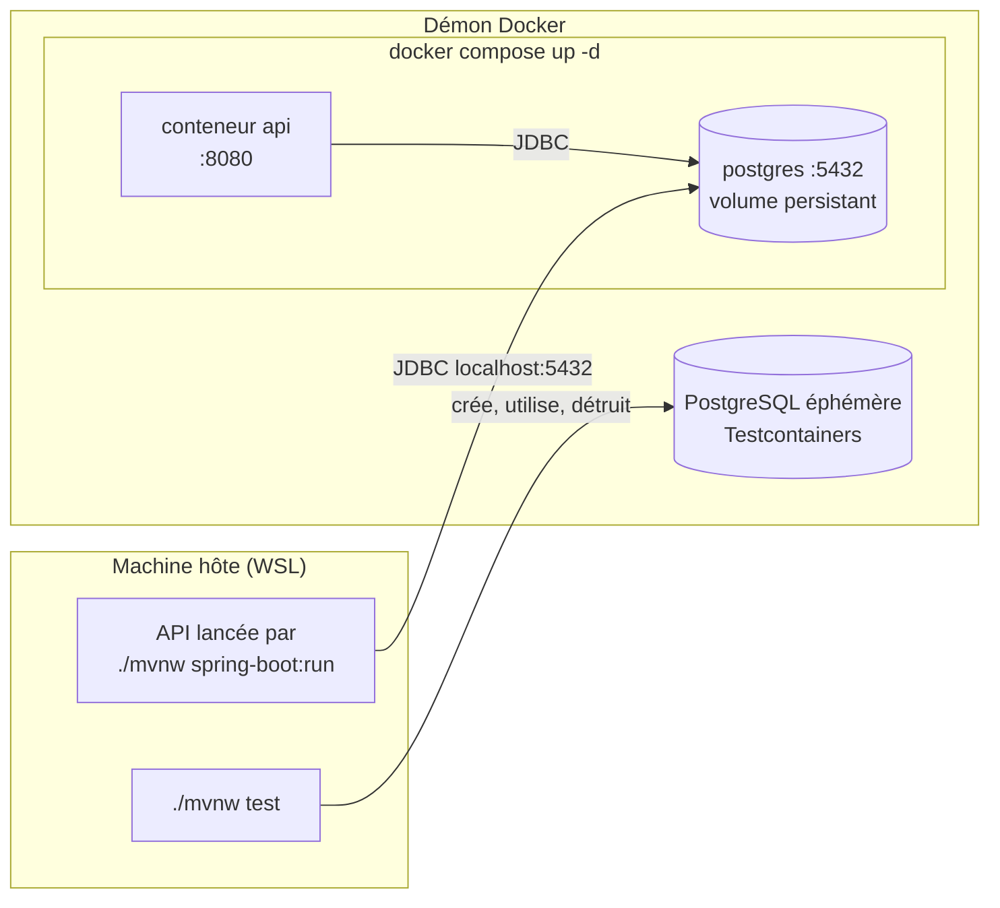
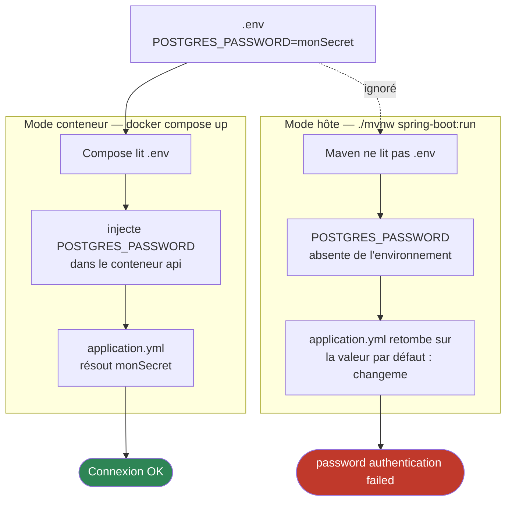
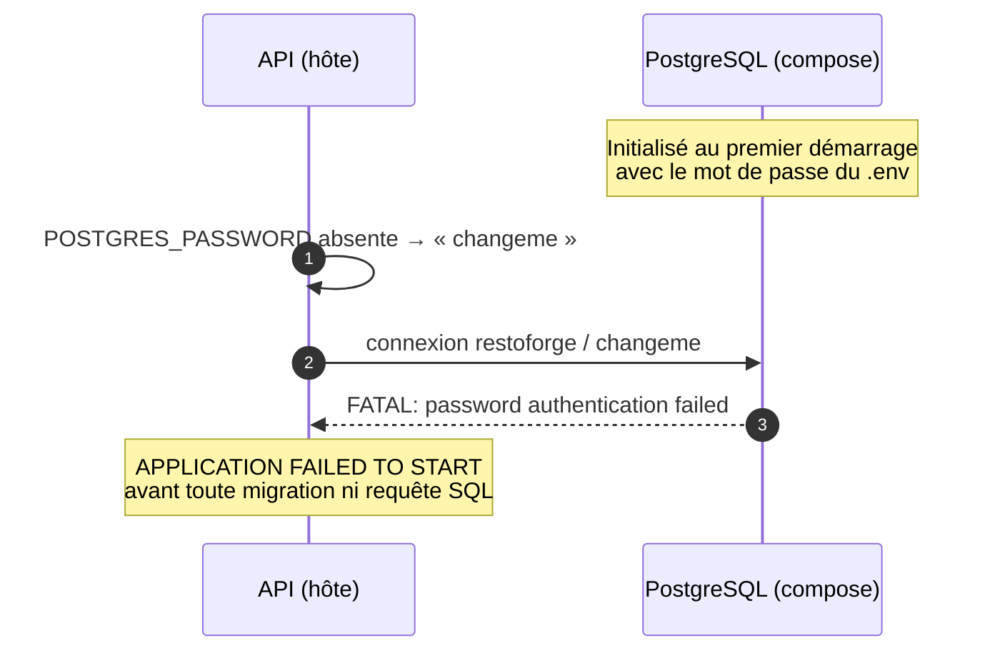
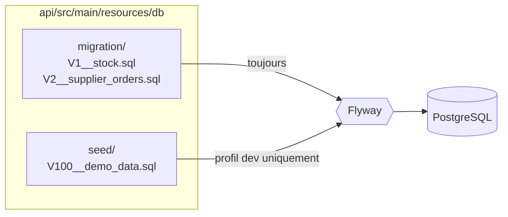

import Tabs from '@theme/Tabs';
import TabItem from '@theme/TabItem';

# Environnement de dev local

L'environnement de développement repose sur Docker. `compose.yaml`, à la racine
du dépôt, orchestre deux services : **PostgreSQL 16** et **l'API Spring Boot**.
Les tests d'intégration utilisent eux aussi Docker, mais par un autre chemin :
Testcontainers.



:::tip[En un coup d'œil]

| Besoin | Commande | PostgreSQL utilisé |
| --- | --- | --- |
| Lancer toute la stack | `docker compose up -d` | Celui du compose |
| Lancer l'API sur l'hôte | voir [Lancer l'API hors conteneur](#lancer-lapi-hors-conteneur) | Celui du compose |
| Vérifier l'image Docker de l'API | `docker compose up -d --build` | Celui du compose |
| Lancer les tests | `./mvnw test` (depuis `api/`) | Celui que Testcontainers crée puis détruit |

Les trois premières lignes partagent la même base. Les tests, jamais.
:::

---

## Prérequis : un démon Docker démarré

Docker **installé** ne suffit pas : il doit être **démarré**, et joignable
depuis le terminal WSL. Sans démon, rien ne fonctionne, pas même
`./mvnw test`, qui ne passe pourtant jamais par `compose.yaml`.

### Démarrer le démon

<Tabs groupId="docker-wsl">
  <TabItem value="desktop" label="Docker Desktop (Windows)" default>

Configuration utilisée sur le projet.

1. Lancer Docker Desktop côté Windows et attendre l'état *Engine running*.
2. Vérifier *Settings → Resources → WSL integration* : l'intégration doit être
   cochée pour la distribution (`Ubuntu-24.04`).

  </TabItem>
  <TabItem value="engine" label="Docker Engine natif (dans WSL)">

Docker Engine installé directement dans la distribution ne démarre **pas**
au lancement de WSL :

```bash
sudo service docker start
```

  </TabItem>
</Tabs>

### Vérifier avant de lancer quoi que ce soit

```bash
docker info | grep -A2 "Server:"   # le démon doit répondre
ls -l /var/run/docker.sock         # le socket doit exister
```

:::caution[Docker Desktop tourne, mais le socket est absent]
La distribution WSL a démarré **avant** Docker Desktop : l'intégration ne s'est
pas branchée. Depuis PowerShell :

```powershell
wsl.exe --shutdown
```

Puis rouvrir un terminal WSL. Docker Desktop étant déjà lancé, le socket est
monté au redémarrage de la distribution.
:::

### Pourquoi les tests ont besoin de Docker

Les tests d'intégration ne tournent ni sur H2 ni sur la base du compose.
Testcontainers démarre un **PostgreSQL éphémère**, de la même image que le
compose (`postgres:16-alpine`), le temps de l'exécution, puis le détruit.
Le démon doit donc être joignable, que le compose tourne ou non.

| | `docker compose up -d` | `./mvnw test` |
| --- | --- | --- |
| Qui crée la base | Docker Compose | Testcontainers |
| Durée de vie | Jusqu'au `down` | Le temps des tests |
| Données | Conservées dans un volume | Jetées à la fin |
| Port | `5432`, fixe | Attribué par Docker, injecté par `@ServiceConnection` |
| Lit `.env` | Oui | Non, inutile : Testcontainers fixe ses propres identifiants |

:::info[Premier lancement]
Le premier `./mvnw test` télécharge l'image PostgreSQL : il paraît
anormalement long. Les lancements suivants réutilisent l'image en cache.
:::

---

## Démarrage : toute la stack en conteneurs

```bash
cp .env.example .env
# éditer .env : définir un vrai POSTGRES_PASSWORD

docker compose up -d

# attendre le statut (healthy) sur postgres
docker compose ps

# attendu : "status":"UP", avec "db" à UP
curl -s localhost:8080/actuator/health
```

:::warning[`up -d` ne reconstruit pas l'image]
Sans `--build`, Compose redémarre l'**image déjà construite** : le code
modifié depuis n'y figure pas. Après une modification de l'API :

```bash
docker compose up -d --build
```
:::

## Les fichiers d'environnement

| Fichier | Versionné | Rôle |
| --- | --- | --- |
| `.env.example` | ✅ oui | Le contrat : liste des variables, valeurs bidon |
| `.env` | ❌ non | Les vraies valeurs (secrets), ignoré par Git |

`.env` n'est **pas** un standard du système : c'est une convention de
Docker Compose, qui le lit automatiquement à côté de `compose.yaml` et
substitue les `${...}`. Aucun autre outil du projet ne le lit.

| Outil | Lit `.env` ? |
| --- | --- |
| `docker compose` | ✅ automatiquement |
| `./mvnw spring-boot:run` | ❌ jamais, voir la section suivante |
| `./mvnw test` | ❌ et n'en a pas besoin |

---

## Lancer l'API hors conteneur

Lancer l'API directement sur la machine hôte (`./mvnw spring-boot:run`, ou
depuis l'IDE avec un débogueur) permet d'itérer sans reconstruire d'image.
PostgreSQL, lui, reste dans le compose.

### Deux modes, deux sources de configuration



`application.yml` déclare chaque variable **avec une valeur par défaut** :

```yaml
password: ${POSTGRES_PASSWORD:changeme}
```

La syntaxe `${VAR:defaut}` signifie « `VAR` si elle existe, sinon `defaut` ».
Quand la variable manque, Spring ne signale rien : il prend la valeur par
défaut et poursuit.

### Anatomie de l'échec



L'échec se produit **à l'authentification**, avant Flyway et avant le moindre
SQL : il ne concerne ni le schéma, ni les migrations, ni le code.

:::note[Pourquoi l'erreur peut ne jamais apparaître]
Si `.env` conserve la valeur `changeme` de `.env.example`, la valeur par
défaut coïncide par hasard avec le vrai mot de passe et tout fonctionne. Le
problème surgit dès qu'un vrai mot de passe est défini.
:::

:::caution[Le mot de passe est figé dans le volume]
PostgreSQL ne lit `POSTGRES_USER`, `POSTGRES_PASSWORD` et `POSTGRES_DB`
**qu'au premier démarrage sur un volume vierge**. Les identifiants sont ensuite
stockés dans le volume : modifier `.env` après coup ne change **pas** le mot de
passe de la base. Pour l'appliquer, il faut
[repartir d'une base vierge](#repartir-dune-base-vierge).
:::

### Charger `.env` pour une commande

Depuis `api/`, là où se trouve le `pom.xml` (`.env` est à la racine du
monorepo) :

```bash
docker compose stop api   # libère le port 8080 occupé par le conteneur api

(set -a && source ../.env && set +a && ./mvnw spring-boot:run)
```

| Fragment | Effet |
| --- | --- |
| `( ... )` | Sous-shell : les variables disparaissent avec lui, le terminal reste propre |
| `set -a` | Toute variable définie ensuite est **exportée** automatiquement |
| `source ../.env` | Exécute `.env` comme un script : chaque ligne `CLE=valeur` définit une variable |
| `set +a` | Désactive l'export automatique |
| `./mvnw spring-boot:run` | Processus enfant : hérite des variables exportées, donc la JVM les voit |

:::info[Pourquoi `set -a` est indispensable]
Un `source` seul crée des variables **du shell**, invisibles des processus
qu'il lance. Maven, puis la JVM, sont des processus enfants : sans export, ils
ne voient rien et l'on retombe sur `changeme`.
:::

:::warning[Conflit de port]
Le conteneur `api` et l'API lancée par Maven écoutent tous deux sur `8080`.
Sans `docker compose stop api`, le démarrage échoue sur
`Web server failed to start. Port 8080 was already in use.`
:::

<details>
<summary>Commodité personnelle : un alias shell</summary>

Pour éviter de retaper la commande, un alias dans `~/.bashrc` :

```bash
alias rf-api='(cd ~/projets/restoforge/api && set -a && source ../.env && set +a && ./mvnw spring-boot:run)'
```

Cet alias relève de la configuration personnelle du poste : il **ne fait pas
partie du dépôt** et ne doit pas être présenté comme la procédure du projet.
La commande de référence reste celle ci-dessus.

</details>

---

## Profils Spring et données de démonstration

Flyway lit deux dossiers distincts, et le second n'est ajouté que sous le
profil `dev` :



| | Sans profil | Profil `dev` |
| --- | --- | --- |
| Dossiers lus par Flyway | `db/migration` | `db/migration` + `db/seed` |
| Schéma (V1, V2) | ✅ | ✅ |
| Jeu de démonstration (V100) | ❌ | ✅ |
| Qui l'utilise | Conteneur `api` du compose, tests, tout déploiement | Développement local sur l'hôte |

La propriété en jeu est `spring.flyway.locations` : `application.yml` la
définit une première fois pour tous les environnements, puis la surcharge dans
le document `on-profile: dev`.

### Activer le profil

<Tabs groupId="profil">
  <TabItem value="maven" label="Argument Maven" default>

```bash
(set -a && source ../.env && set +a && \
  ./mvnw spring-boot:run -Dspring-boot.run.profiles=dev)
```

  </TabItem>
  <TabItem value="env" label="Variable d'environnement">

```bash
(set -a && source ../.env && set +a && \
  SPRING_PROFILES_ACTIVE=dev ./mvnw spring-boot:run)
```

  </TabItem>
</Tabs>

Le conteneur `api` du compose ne déclare **aucun** profil : il démarre sans
données de démonstration.

### Ce que l'on observe en base

```bash
docker exec -it restoforge-postgres psql -U restoforge -d restoforge
```

```sql
SELECT version, description FROM flyway_schema_history
  ORDER BY installed_rank;
SELECT count(*) FROM supplier;
SELECT count(*) FROM product;
SELECT count(*) FROM supplier_order;
```

| Requête | Sans profil | Profil `dev` |
| --- | --- | --- |
| Versions dans `flyway_schema_history` | `1`, `2` | `1`, `2`, `100` |
| `supplier` | 0 | 2 (Metro, Planète Fish) |
| `product` | 0 | 7, dont 3 sous le seuil |
| `supplier_order` | 0 | 1 commande `DRAFT` chez Metro |

### Pourquoi cette séparation

:::danger[Le seed ne doit jamais atteindre un environnement déployé]
Appliqué en production, le jeu de démonstration insérerait des fournisseurs et
une commande fictifs **au milieu des données du client**, sans retour arrière
simple. Le profil `dev` est la seule porte d'entrée du dossier `db/seed`.
:::

La numérotation à partir de `100` laisse la place aux migrations de schéma. Tant
que le schéma reste sous `V100`, une base ayant reçu le seed peut être
réutilisée sans profil : Flyway classe `V100` comme migration « future » et
l'ignore. La limite de ce mécanisme est traitée dans la section suivante.

---

## Persistance des données

Les données vivent dans le volume nommé `restoforge_db_data`, géré par Docker
**à l'extérieur du conteneur** (monté sur `/var/lib/postgresql/data`).
Le conteneur est jetable, les données ne le sont pas.

```bash
docker compose down   # détruit les conteneurs, GARDE les données
docker volume ls      # restoforge_db_data est toujours là
```

## Repartir d'une base vierge

| Commande | Conteneurs | Volume : données **et** `flyway_schema_history` |
| --- | --- | --- |
| `docker compose down` | ❌ supprimés | ✅ conservé |
| `docker compose down -v` | ❌ supprimés | ❌ **supprimé** |

Le drapeau `-v` est le seul point à retenir : sans lui, le volume persiste et
la base redémarre dans l'état exact où elle était.

```bash
docker compose down -v
docker compose up -d postgres   # volume neuf : PostgreSQL s'initialise avec le .env actuel
```

Au démarrage suivant de l'API, Flyway trouve une base vide et rejoue toutes les
migrations.

### Pourquoi c'est le bon réflexe pendant la construction du schéma

Flyway enregistre dans `flyway_schema_history` un **checksum** de chaque
migration appliquée. Au démarrage, il recalcule ces checksums : si un fichier
déjà appliqué a été modifié, l'application refuse de démarrer
(`Migration checksum mismatch for migration version 1`).

Tant qu'une migration n'a été partagée avec personne, la réécrire puis repartir
d'une base vierge est plus simple qu'empiler une migration correctrice.

:::caution[Base de dev et nouvelle migration de schéma]
Sur une base ayant reçu le seed `V100`, une nouvelle migration `V3__...` est
**antérieure** à la dernière version appliquée. Flyway la refuse
(`Detected resolved migration not applied to database: 3`). Sur une base de
développement, la réponse est `docker compose down -v`, puis un redémarrage
avec le profil `dev` : `V1`, `V2`, `V3`, puis `V100` sont rejouées dans l'ordre.
:::

:::danger[Réservé au développement local]
`down -v` détruit **définitivement** toutes les données. Sur une base partagée
ou déployée, la perte est irréversible. Une migration déjà publiée ne se
corrige jamais par une réinitialisation : elle se corrige par une **nouvelle
migration**.
:::

---

## Se connecter à la base

Via le conteneur, sans installer `psql` sur le poste :

```bash
docker exec -it restoforge-postgres psql -U restoforge -d restoforge
```

Commandes utiles dans le prompt `psql` : `\l` (bases), `\dt` (tables),
`\d product` (structure d'une table), `\q` (quitter).

## Healthcheck

Le service `postgres` déclare un `healthcheck` basé sur `pg_isready` : Docker
vérifie toutes les 5 s que la base accepte réellement les connexions, et
expose le résultat dans la colonne STATUS de `docker compose ps`
(`healthy` / `unhealthy`).

Le service `api` en dépend via `depends_on: postgres: condition: service_healthy` :
il ne démarre qu'une fois la base réellement prête, et non dès que le
conteneur est lancé. Un simple `depends_on` n'attendrait que le lancement du
conteneur, et l'API, prête en quelques secondes, se heurterait à une base
encore en cours d'initialisation.

---

## Diagnostic

### Valider la configuration Compose

```bash
docker compose config
```

Valide et affiche la configuration résolue (variables substituées) **sans rien
lancer**. Des `WARN variable is not set` signalent un `.env` absent ou mal
placé.

### Lire un échec au démarrage

Un échec Spring Boot produit des centaines de lignes. Trois niveaux de
lecture, du plus visible au plus utile :

| Niveau | Où | Ce qu'on y lit |
| --- | --- | --- |
| 1. Résumé Maven | Fin de la console | `Failed to load ApplicationContext` : quelque chose a échoué, sans dire quoi |
| 2. Rapport Surefire | `api/target/surefire-reports/*.txt` | La trace complète, conservée après le build |
| 3. Dernier `Caused by` | Dans la console ou le rapport | **La cause réelle** |

Une trace Java se lit comme des **enveloppes emboîtées** : la première ligne
dit **ce qui** a échoué, le dernier `Caused by` dit **pourquoi**. Tout ce qui
se trouve entre les deux est la cascade des beans qui dépendaient du premier
échec.

```text
IllegalStateException: Failed to load ApplicationContext        ← le symptôme
└─ Caused by: BeanCreationException: flywayContainerConnection…
   └─ Caused by: BeanCreationException: postgresContainer
      └─ Caused by: IllegalStateException:
            Could not find a valid Docker environment          ← la cause
```

Pour aller directement aux causes depuis un rapport de test :

```bash
# depuis api/
grep -n "Caused by" target/surefire-reports/*.txt | tail -3
```

:::tip[Se fier au dernier `Caused by`, pas à la cascade]
L'ordre des beans intermédiaires dépend de l'initialisation et peut changer
d'une exécution à l'autre (`entityManagerFactory`, `flyway`,
`flywayContainerConnectionDetails…`). Seule la cause finale est stable.
:::

:::info[La durée est un indice]
Un `./mvnw test` qui échoue en **quelques secondes** n'a démarré aucun
conteneur : Testcontainers a abandonné immédiatement. C'est la signature d'un
démon Docker injoignable.
:::

<details>
<summary>Exemple complet : tests lancés sans démon Docker</summary>

Résumé Maven, en fin de console :

```text
[ERROR] Errors:
[ERROR]   ApiApplicationTests.contextLoads » IllegalState Failed to load ApplicationContext for [WebMergedContextConfiguration@38dbeb39 testClass = com.restoforge.api.ApiApplicationTests, ...]
[ERROR] Tests run: 1, Failures: 0, Errors: 1, Skipped: 0
[INFO] BUILD FAILURE
[INFO] Total time:  3.515 s
```

Causes, extraites du rapport Surefire :

```text
Caused by: org.springframework.beans.factory.BeanCreationException: Error creating bean with name 'flywayContainerConnectionDetailsForPostgresContainer': Error creating bean with name 'postgresContainer' defined in class path resource [com/restoforge/api/TestcontainersConfiguration.class]: Could not find a valid Docker environment. Please see logs and check configuration
Caused by: org.springframework.beans.factory.BeanCreationException: Error creating bean with name 'postgresContainer' defined in class path resource [com/restoforge/api/TestcontainersConfiguration.class]: Could not find a valid Docker environment. Please see logs and check configuration
Caused by: java.lang.IllegalStateException: Could not find a valid Docker environment. Please see logs and check configuration
```

</details>

### Symptômes fréquents

| Message | Cause | Remède |
| --- | --- | --- |
| `Could not find a valid Docker environment` | Démon Docker arrêté ou injoignable depuis WSL | [Démarrer le démon](#prérequis--un-démon-docker-démarré) |
| `password authentication failed for user "restoforge"` | `.env` non chargé : l'API utilise `changeme` | [Charger `.env`](#charger-env-pour-une-commande) |
| Même message, `.env` bien chargé | Volume initialisé avec un autre mot de passe | [Repartir d'une base vierge](#repartir-dune-base-vierge) |
| `Port 8080 was already in use` | Le conteneur `api` tourne | `docker compose stop api` |
| `Migration checksum mismatch` | Migration déjà appliquée puis modifiée | [Repartir d'une base vierge](#repartir-dune-base-vierge) |
| `Detected resolved migration not applied to database` | Nouvelle migration de schéma sur une base ayant reçu `V100` | [Repartir d'une base vierge](#repartir-dune-base-vierge) |
| Le code modifié n'a aucun effet dans le conteneur | Image non reconstruite | `docker compose up -d --build` |
